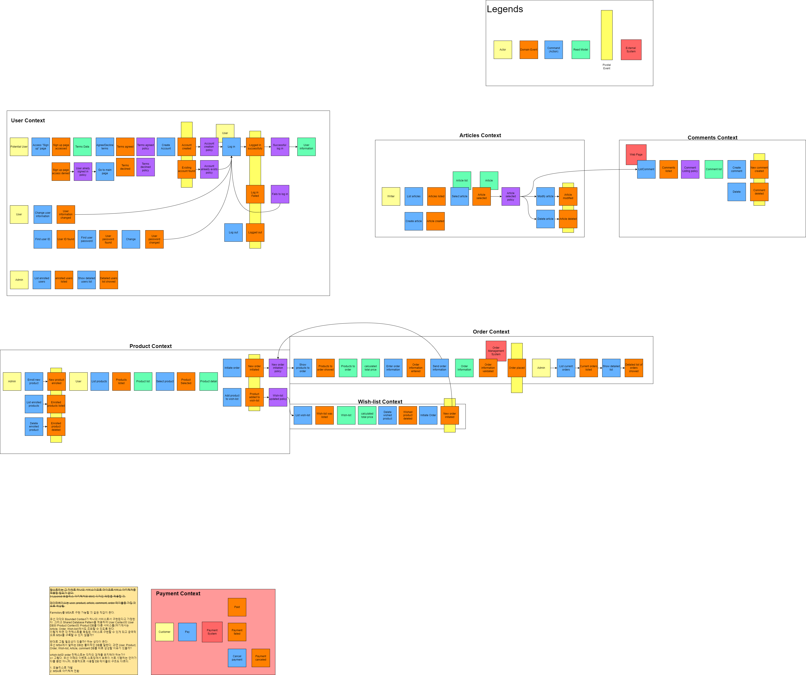
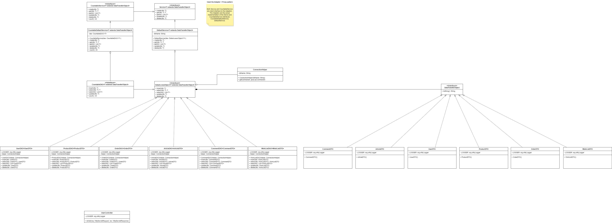

# 필독!!!!!

# 1. 시스템 요구사항

- Apache Tomcat v10.1.34
- Java SE 21
- MySQL v8.4.3

## 1.1 Dependencies

- commons-fileupload2-jakarta-servlet6-2.0.0-M2
- commons-io-2.18.0
- logback-classic-1.5.16
- logback-core-1.5.16
- mysql-connector-j-9.2.0
- slf5j-api-2.0.16

## 2. 브랜치 전략

브랜치 전략으로는 **Github Flow**를 사용한다. 주 브랜치로 `master`브랜치를 사용하고 팀원들은 로컬 저장소에서 `feature/팀원아이디` 브랜치를 생성한다.
코드를 변경할 때에는 **반드시** `feature/팀원아이디` 브랜치를 이용하고, 모든 변경이 끝나면 이를 `push`하고 `merge` 한다.

## 3. Software Design Diagrams

### 3.1 EventStroming

### 3.2 C4 Model - System

### 3.3 C4 Model - Container

### 3.4 C4 Model - Container

### 3.5 UML Diagram

# 1stProject
